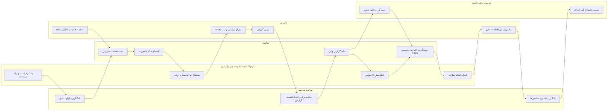
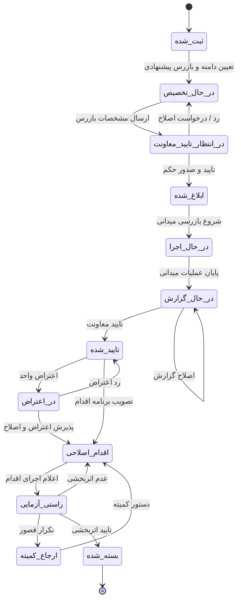

# چرخه بازرسی — فرایند انجام کار

> نمودار کامل فرایند بازرسی از لحظه‌ی ثبت درخواست تا بستن پرونده و بازخورد به برنامه‌ی سالانه.
> نقطه‌ی شروع تاییدیه‌ها: **مشخصات بازرس → تایید معاونت → صدور حکم ماموریت**.

نسخه‌ی گرافیکی و تعاملی: [`inspection-cycle.html`](./inspection-cycle.html)

---

## ۱) نقش‌ها (مسیرهای شنا)

| نقش | مسئولیت اصلی در چرخه |
|---|---|
| **درخواست‌کننده / واحد مورد بازرسی** | ثبت درخواست، ارائه مستندات، اعلام نظر/اعتراض، اجرای اقدام اصلاحی |
| **دبیرخانه (دفتر) بازرسی** | ثبت و کدگذاری، اولویت‌بندی، برنامه‌ریزی، کنترل کیفیت گزارش، بایگانی، داشبورد شاخص‌ها |
| **بازرس / تیم بازرسی** | بررسی صلاحیت و تعارض منافع، اجرای بازرسی، ثبت یافته‌ها، تدوین گزارش، راستی‌آزمایی |
| **معاونت** | **تایید مشخصات بازرس**، امضای حکم ماموریت، تایید گزارش نهایی، رسیدگی به اعتراض، تصویب برنامه اقدام |
| **مدیریت ارشد / کمیته رسیدگی** | موارد تخلف محرز یا بحرانی، کمیته انضباطی، تصویب تغییرات آیین‌نامه‌ای |
| **سامانه مستندسازی** | ثبت وضعیت پرونده، کنترل نسخه، نگهداری سوابق، تولید گزارش‌های دوره‌ای |

---

## ۲) نمودار اصلی فرایند

```mermaid
flowchart TD
    classDef start fill:#e7f5ff,stroke:#1971c2,stroke-width:2px,color:#0b3d66;
    classDef task  fill:#ffffff,stroke:#868e96,color:#212529;
    classDef insp  fill:#e6fcf5,stroke:#0ca678,color:#0b3d33;
    classDef deputy fill:#fff4e6,stroke:#e8590c,color:#5c2c00;
    classDef unit  fill:#f3f0ff,stroke:#7048e8,color:#2b1a66;
    classDef top   fill:#fff5f5,stroke:#e03131,color:#5c0f0f;
    classDef done  fill:#f8f0fc,stroke:#9c36b5,color:#3d1250;

    A([منبع بازرسی: برنامه سالانه / شکایت / گزارش تخلف / دستور مدیریت / پیگیری دوره قبل]):::start
    B[گام ۱ — ثبت در دبیرخانه بازرسی<br/>کد رهگیری، اولویت‌بندی عادی یا فوری]:::task
    C[گام ۲ — تعیین نوع، دامنه و معیارهای بازرسی<br/>انتخاب بازرس واجد صلاحیت، بررسی تعارض منافع]:::task
    D{گام ۳ — تایید مشخصات بازرس<br/>توسط معاونت؟}:::deputy
    E[گام ۴ — صدور حکم ماموریت بازرسی<br/>امضای معاونت + مهلت، دامنه اختیارات و محرمانگی]:::deputy
    F[گام ۵ — ابلاغ و هماهنگی با واحد<br/>بازرسی اعلام‌شده: تعیین زمان / سرزده: بدون اعلام]:::unit
    G[گام ۶ — آماده‌سازی تیم بازرسی<br/>چک‌لیست، مستندات مرجع، معرفی‌نامه، تجهیزات]:::insp
    H[گام ۷ — جلسه افتتاحیه<br/>معرفی تیم، دامنه، روش کار و زمان‌بندی]:::insp
    I[گام ۸ — اجرای بازرسی میدانی<br/>بررسی مستندات، مشاهده، مصاحبه، نمونه‌برداری و تست]:::insp
    J[گام ۹ — ثبت یافته‌ها و شواهد<br/>مغایرت بحرانی / عمده / جزئی + نقاط قوت]:::insp
    K{گام ۱۰ — نیاز به کارشناسی،<br/>نمونه یا تست تکمیلی؟}:::insp
    L[گام ۱۱ — جلسه اختتامیه<br/>اعلام یافته‌های اولیه و دریافت توضیحات واحد]:::insp
    M[گام ۱۲ — تدوین پیش‌نویس گزارش بازرسی]:::insp
    N[گام ۱۳ — بازبینی کیفی توسط سرپرست بازرسی<br/>کنترل شواهد، استناد به معیار، لحن و بی‌طرفی]:::task
    O{گام ۱۴ — تایید گزارش توسط معاونت؟}:::deputy
    P[گام ۱۵ — ابلاغ گزارش نهایی به واحد<br/>ثبت در سامانه و شروع مهلت پاسخ]:::unit
    Q{گام ۱۶ — اعتراض واحد به گزارش؟}:::unit
    R[گام ۱۷ — رسیدگی به اعتراض توسط معاونت<br/>پذیرش: اصلاح گزارش / رد: ابلاغ نتیجه]:::deputy
    S{گام ۱۸ — تخلف محرز یا مغایرت بحرانی؟}:::top
    T[گام ۱۹ — ارجاع به کمیته رسیدگی / حراست<br/>رسیدگی خارج از چرخه عادی، نتیجه به پرونده برمی‌گردد]:::top
    U[گام ۲۰ — تعیین اقدامات اصلاحی CAPA<br/>مسئول اجرا، مهلت و شاخص اثربخشی + تصویب معاونت]:::unit
    V[گام ۲۱ — اجرای اقدام اصلاحی توسط واحد<br/>ارسال مستندات و شواهد اجرا]:::unit
    W{گام ۲۲ — راستی‌آزمایی اثربخشی<br/>توسط بازرس تایید شد؟}:::insp
    X[گام ۲۳ — ارجاع به کمیته انضباطی<br/>تکرار عدم اثربخشی یا قصور]:::top
    Y[گام ۲۴ — صدور نامه رفع مغایرت و بستن پرونده]:::done
    Z[گام ۲۵ — بایگانی سوابق و به‌روزرسانی داشبورد شاخص‌ها]:::done
    AA[گام ۲۶ — درس‌آموخته‌ها و بازنگری چک‌لیست و آیین‌نامه<br/>گزارش دوره‌ای به مدیریت ارشد]:::done
    AB([بازگشت به برنامه‌ریزی بازرسی دوره بعد — بهبود مستمر]):::start

    A --> B --> C --> D
    D -- "خیر / نیاز به اصلاح" --> C
    D -- بله --> E --> F --> G --> H --> I --> J --> K
    K -- بله --> I
    K -- خیر --> L --> M --> N --> O
    O -- "اصلاح گزارش" --> M
    O -- بله --> P --> Q
    Q -- بله --> R --> P
    Q -- "خیر / پایان مهلت" --> S
    S -- بله --> T --> U
    S -- خیر --> U
    U --> V --> W
    W -- "خیر — مهلت جدید" --> U
    W -- "خیر — تکرار قصور" --> X --> U
    W -- بله --> Y --> Z --> AA --> AB
```

---

## ۳) نمای مسیرهای شنا (چه کسی چه کاری می‌کند)

---

## ۴) چرخه وضعیت پرونده بازرسی (برای پیاده‌سازی نرم‌افزاری)

---

## ۵) جدول گام‌ها: مسئول، ورودی، خروجی و مهلت پیشنهادی

| # | گام | مسئول | ورودی | خروجی / رکورد | مهلت پیشنهادی |
|---|---|---|---|---|---|
| ۱ | ثبت درخواست و کدگذاری | دبیرخانه بازرسی | درخواست / شکایت / برنامه سالانه | پرونده با کد رهگیری و اولویت | ۱ روز کاری |
| ۲ | تعیین دامنه و انتخاب بازرس | دفتر بازرسی + بازرس | پرونده، معیارهای بازرسی | برگه دامنه بازرسی، اعلامیه صلاحیت و تعارض منافع | ۲ روز کاری |
| ۳ | **تایید مشخصات بازرس** | **معاونت** | مشخصات بازرس، دامنه، صلاحیت‌ها | دستور تایید / ابطال با ذکر دلیل | ۲ روز کاری |
| ۴ | صدور حکم ماموریت | معاونت | تاییدیه گام ۳ | حکم امضاشده، مهلت و اختیارات | ۱ روز کاری |
| ۵ | ابلاغ و هماهنگی | دبیرخانه / واحد | حکم ماموریت | صورت‌جلسه هماهنگی یا گزارش ابلاغ سرزده | ۲ روز کاری |
| ۶ | آماده‌سازی تیم | بازرس | چک‌لیست و مستندات مرجع | بسته بازرسی تکمیل‌شده | ۲ روز کاری |
| ۷ | جلسه افتتاحیه | بازرس / واحد | بسته بازرسی | صورت‌جلسه افتتاحیه | روز شروع |
| ۸ | اجرای بازرسی میدانی | بازرس | چک‌لیست، دسترسی به سوابق | چک‌لیست تکمیل، شواهد و نمونه‌ها | ۳ تا ۱۰ روز کاری |
| ۹ | ثبت یافته‌ها | بازرس | شواهد | فهرست مغایرت‌ها با درجه‌بندی | هم‌زمان با اجرا |
| ۱۰ | تصمیم نیاز به کارشناسی تکمیلی | بازرس | کمبود شواهد | درخواست کارشناسی / تست اضافه | ۲ روز کاری |
| ۱۱ | جلسه اختتامیه | بازرس / واحد | یافته‌های اولیه | صورت‌جلسه اختتامیه با امضای طرفین | آخرین روز اجرا |
| ۱۲ | تدوین پیش‌نویس گزارش | بازرس | یافته‌ها و صورت‌جلسه‌ها | پیش‌نویس گزارش بازرسی | ۳ روز کاری |
| ۱۳ | بازبینی کیفی | سرپرست بازرسی | پیش‌نویس | یادداشت بازبینی / تایید داخلی | ۲ روز کاری |
| ۱۴ | **تایید گزارش** | **معاونت** | گزارش بازبینی‌شده | دستور اصلاح یا تایید | ۳ روز کاری |
| ۱۵ | ابلاغ گزارش نهایی | دبیرخانه | گزارش تاییدشده | رسید ابلاغ، شروع مهلت پاسخ | ۱ روز کاری |
| ۱۶ | اعلام نظر / اعتراض | واحد مورد بازرسی | گزارش نهایی | لایحه اعتراض با مستندات | ۵ روز کاری |
| ۱۷ | رسیدگی به اعتراض | معاونت | لایحه اعتراض | رای پذیرش یا رد اعتراض | ۵ روز کاری |
| ۱۸ | تشخیص تخلف محرز | معاونت | ماهیت مغایرت | صورت‌جلسه ارجاع | ۲ روز کاری |
| ۱۹ | ارجاع به کمیته / حراست | مدیریت ارشد | صورت‌جلسه ارجاع | نتیجه رسیدگی | حسب مورد |
| ۲۰ | تعیین اقدامات اصلاحی | واحد + معاونت | مغایرت‌های تاییدشده | برنامه اقدام با مسئول و مهلت | ۵ روز کاری |
| ۲۱ | اجرای اقدام اصلاحی | واحد | برنامه اقدام مصوب | گزارش اجرا و شواهد | حسب مهلت مصوب |
| ۲۲ | راستی‌آزمایی اثربخشی | بازرس | شواهد اجرا | برگه راستی‌آزمایی | ۵ روز کاری پس از اعلام |
| ۲۳ | ارجاع به کمیته انضباطی | مدیریت ارشد | تکرار عدم اثربخشی | دستور کمیته | حسب مورد |
| ۲۴ | رفع مغایرت و بستن پرونده | معاونت / دبیرخانه | راستی‌آزمایی تاییدشده | نامه رفع مغایرت، وضعیت «بسته‌شده» | ۱ روز کاری |
| ۲۵ | بایگانی و داشبورد | دبیرخانه | کل مستندات پرونده | سابقه بایگانی‌شده، به‌روزرسانی شاخص‌ها | ۲ روز کاری |
| ۲۶ | درس‌آموخته و بازنگری | دفتر بازرسی + مدیریت | آمار و یافته‌های دوره | چک‌لیست به‌روز، گزارش دوره‌ای | پایان هر دوره |

**میانگین زمان چرخه کامل (بدون ارجاع به کمیته):** حدود ۳۵ تا ۵۰ روز کاری.

---

## ۶) قواعد تصمیم و حلقه‌های بازگشت

| نقطه تصمیم | مسیر «بله» | مسیر «خیر» |
|---|---|---|
| گام ۳ — تایید مشخصات بازرس | صدور حکم ماموریت | بازگشت به گام ۲ و انتخاب بازرس جایگزین |
| گام ۱۰ — نیاز به کارشناسی تکمیلی | بازگشت به گام ۸ با مهلت محدود | ادامه به جلسه اختتامیه |
| گام ۱۴ — تایید گزارش | ابلاغ به واحد | بازگشت به گام ۱۲ برای اصلاح |
| گام ۱۶ — اعتراض واحد | رسیدگی در گام ۱۷ | ورود به تعیین اقدام اصلاحی |
| گام ۱۸ — تخلف محرز | ارجاع به کمیته (موازی با اقدام اصلاحی) | فقط اقدام اصلاحی |
| گام ۲۲ — اثربخشی اقدام | بستن پرونده | مهلت جدید؛ در تکرار، کمیته انضباطی |

**قواعد کلیدی**
- هیچ بازرسی بدون تایید کتبی معاونت روی مشخصات بازرس شروع نمی‌شود.
- تعارض منافع بازرس (قرابت، ذی‌نفعی، سابقه کاری در واحد هدف) مانع تایید است.
- هر حلقه بازگشت حداکثر دو بار مجاز است؛ بار سوم به تصمیم معاونت/کمیته موکول می‌شود.
- بازرسی سرزده فقط با مجوز کتبی معاونت و بدون ابلاغ قبلی انجام می‌شود.
- مهلت‌ها با ثبت در سامانه به‌صورت خودکار پایش و هشدار داده می‌شوند.

---

## ۷) شاخص‌های پایش چرخه

| شاخص | فرمول | هدف نمونه |
|---|---|---|
| نرخ انجام به‌موقع | بازرسی‌های انجام‌شده در مهلت ÷ کل برنامه | بیش از ۹۰٪ |
| میانگین زمان تا تایید بازرس | میانگین فاصله گام ۲ تا ۳ | کمتر از ۲ روز کاری |
| میانگین زمان چرخه | از ثبت درخواست تا بستن پرونده | کمتر از ۴۵ روز کاری |
| نرخ مغایرت | مغایرت‌ها ÷ موارد بررسی‌شده | روند کاهشی |
| اثربخشی اقدام اصلاحی | موارد تاییدشده در راستی‌آزمایی نخست ÷ کل موارد | بیش از ۸۰٪ |
| نرخ بازگشت گزارش | گزارش‌های نیازمند اصلاح ÷ کل گزارش‌ها | کمتر از ۱۵٪ |
| پرونده‌های باز بیش از مهلت | شمار پرونده‌های گذشته‌از‌مهلت | صفر |
