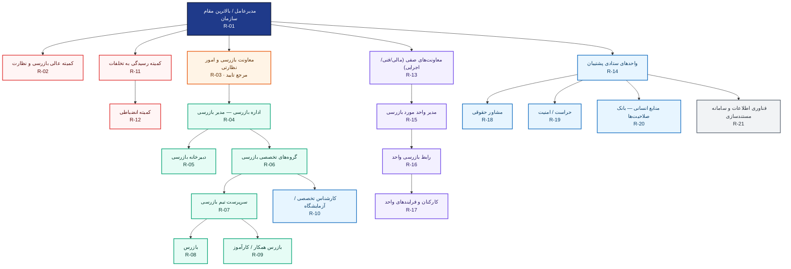
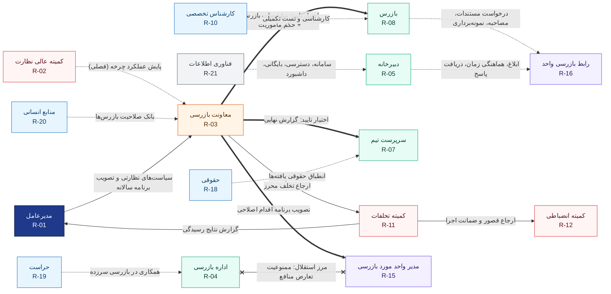

# چارت درختی نقش‌ها و ارتباطات — نظام بازرسی

> ساختار سلسله‌مراتبی نقش‌های درگیر در چرخه بازرسی + شبکه ارتباطات میان آن‌ها.
> نسخه گرافیکی و تعاملی: [`roles-org-chart.html`](./roles-org-chart.html)
> فرایند مرحله‌به‌مرحله: [`inspection-cycle.md`](./inspection-cycle.md)

---

## ۱) نمودار درختی نقش‌ها

**خلاصه ساختار:** ۲۱ نقش · ۶ سطح سلسله‌مراتب · ۷ دسته نقش · ۱۴ خط ارتباطی تعریف‌شده.

---

## ۲) نمودار ارتباطات (خطوط غیرسلسله‌مراتبی)

### راهنمای خطوط

| نوع خط | معنا | نمونه |
|---|---|---|
| **ممتد سرمه‌ای** | سلسله‌مراتب و گزارش‌دهی | بازرس ← سرپرست ← اداره بازرسی ← معاونت |
| **ضخیم نارنجی** | اختیار تایید و تصویب | تایید مشخصات بازرس، تایید گزارش، تصویب اقدام اصلاحی |
| **خط‌چین سبز** | هماهنگی اجرایی | ابلاغ و هماهنگی زمان، درخواست مستندات، کارشناسی تکمیلی |
| **نقطه‌چین بنفش** | مشاوره و پشتیبانی | حقوقی، منابع انسانی، فناوری اطلاعات |
| **خط‌چین قرمز** | ارجاع نظارتی / تخلفات | معاونت ← کمیته تخلفات ← کمیته انضباطی |
| **خط‌چین ضخیم زرشکی** | مرز استقلال (تعارض منافع) | جدایی کامل تیم بازرسی از واحد مورد بازرسی |

---

## ۳) ماتریس ارتباطات

| # | از | به | نوع | محتوا / موضوع تبادل | فراوانی |
|---|---|---|---|---|---|
| ۱ | معاونت بازرسی | بازرس | اختیار تایید | تایید مشخصات بازرس و صدور حکم ماموریت | هر پرونده |
| ۲ | معاونت بازرسی | سرپرست تیم | اختیار تایید | تایید گزارش نهایی بازرسی | هر پرونده |
| ۳ | معاونت بازرسی | مدیر واحد مورد بازرسی | اختیار تایید | تصویب برنامه اقدام اصلاحی (CAPA) | هر مغایرت |
| ۴ | معاونت بازرسی | کمیته تخلفات | ارجاع نظارتی | ارجاع تخلف محرز یا مغایرت بحرانی | موردی |
| ۵ | کمیته عالی نظارت | معاونت بازرسی | مشاوره/پایش | پایش و ارزیابی عملکرد چرخه بازرسی | فصلی |
| ۶ | بازرس | رابط بازرسی واحد | هماهنگی اجرایی | درخواست مستندات، مصاحبه، نمونه‌برداری | در طول اجرا |
| ۷ | دبیرخانه بازرسی | رابط بازرسی واحد | هماهنگی اجرایی | ابلاغ، هماهنگی زمان، دریافت پاسخ | مستمر |
| ۸ | اداره بازرسی | مدیر واحد مورد بازرسی | مرز استقلال | ممنوعیت هرگونه تعارض منافع و ذی‌نفعی | دائم |
| ۹ | کارشناس تخصصی | بازرس | هماهنگی اجرایی | کارشناسی و تست تکمیلی (گام ۱۰ چرخه) | موردی |
| ۱۰ | مشاور حقوقی | سرپرست تیم | مشاوره | انطباق حقوقی یافته‌ها و مستندسازی استناد | موردی |
| ۱۱ | حراست | اداره بازرسی | هماهنگی اجرایی | همکاری و همراهی در بازرسی سرزده | موردی |
| ۱۲ | منابع انسانی | معاونت بازرسی | مشاوره | بانک اطلاعات صلاحیت بازرس‌ها و آموزش | فصلی |
| ۱۳ | فناوری اطلاعات | دبیرخانه بازرسی | پشتیبانی | سامانه، دسترسی، بایگانی، داشبورد شاخص‌ها | دائم |
| ۱۴ | کمیته تخلفات | کمیته انضباطی | ارجاع نظارتی | ارجاع قصور و تعیین ضمانت اجرا | موردی |

**گزارش‌دهی سلسله‌مراتبی (پیش‌فرض همه‌ی خطوط عمودی چارت):**
کارآموز/بازرس ← سرپرست تیم ← گروه تخصصی ← اداره بازرسی ← معاونت بازرسی ← مدیرعامل؛
و در سمت صف: کارکنان واحد ← رابط بازرسی ← مدیر واحد ← معاونت صفی ← مدیرعامل.

---

## ۴) شناسنامه نقش‌ها

| کد | نقش | جایگاه | اختیارات و وظایف کلیدی در چرخه بازرسی |
|---|---|---|---|
| R-01 | مدیرعامل / بالاترین مقام سازمان | مدیریت ارشد | تعیین سیاست‌های نظارتی، تصویب برنامه سالانه، دریافت گزارش دوره‌ای شاخص‌ها |
| R-02 | کمیته عالی بازرسی و نظارت | نهاد نظارتی ترکیبی | راهبری سیاست‌ها، پایش عملکرد چرخه، تصویب تغییرات آیین‌نامه |
| R-03 | معاونت بازرسی و امور نظارتی | مرجع تصویب | **تایید مشخصات بازرس**، امضای حکم ماموریت، تایید گزارش، رسیدگی به اعتراض، تصویب CAPA، ارجاع تخلف |
| R-04 | اداره بازرسی (مدیر بازرسی) | صف نظارتی | اجرای برنامه، تخصیص پرونده، کنترل نهایی داخلی، گزارش تجمیعی ماهانه |
| R-05 | دبیرخانه بازرسی | پشتیبانی اجرایی | ثبت و کدگذاری، اولویت‌بندی، ابلاغ و هماهنگی، بایگانی، داشبورد و هشدار مهلت‌ها |
| R-06 | گروه‌های تخصصی بازرسی | مالی/فنی/اداری/ایمنی/IT | سازماندهی تیم بر اساس تخصص، تدوین و به‌روزرسانی چک‌لیست‌ها |
| R-07 | سرپرست تیم بازرسی | بازرس ارشد | کنترل کیفیت گزارش، تقسیم کار، تایید شواهد و درجه‌بندی مغایرت، راستی‌آزمایی |
| R-08 | بازرس | مجری بازرسی | اعلام تعارض منافع، اجرای بازرسی، ثبت یافته‌ها و شواهد، تدوین گزارش |
| R-09 | بازرس همکار / کارآموز | تحت نظارت سرپرست | پشتیبانی اجرا، مستندسازی شواهد |
| R-10 | کارشناس تخصصی / آزمایشگاه | پشتیبانی فنی | کارشناسی موردی، نمونه‌برداری و تست، برآورد ریالی مغایرت |
| R-11 | کمیته رسیدگی به تخلفات | کمیته ترکیبی | رسیدگی به تخلف محرز، صدور رای، ارجاع به کمیته انضباطی |
| R-12 | کمیته انضباطی | کمیته دائمی | رسیدگی به قصور و تکرار عدم اثربخشی، تعیین ضمانت اجرا |
| R-13 | معاونت‌های صفی | مالی/فنی/اجرایی | مسئولیت عملکرد واحدها، پاسخ‌گویی به یافته‌ها، تامین منابع اقدام اصلاحی |
| R-14 | واحدهای ستادی پشتیبان | ستاد سازمان | مشاوره تخصصی، پشتیبانی حقوقی/امنیتی/فناوری |
| R-15 | مدیر واحد مورد بازرسی | صف اجرایی | پاسخ‌گویی به گزارش، اعلام نظر یا اعتراض، تعیین و اجرای اقدام اصلاحی |
| R-16 | رابط بازرسی واحد | نقطه تماس | هماهنگی زمان و جلسات، گردآوری مستندات، پیگیری مهلت‌ها |
| R-17 | کارکنان و فرایندهای واحد | دامنه بازرسی | همکاری در مصاحبه، اجرای رویه‌های اصلاح‌شده |
| R-18 | مشاور حقوقی | حقوقی و قراردادها | انطباق حقوقی یافته‌ها، بررسی قراردادها، تنظیم لوایح |
| R-19 | حراست / امنیت | امور امنیتی | همکاری در بازرسی سرزده، حفاظت از مستندات حساس |
| R-20 | منابع انسانی | بانک صلاحیت‌ها | نگهداری بانک بازرس‌ها، ارزیابی صلاحیت و آموزش، اعلام تعارض منافع |
| R-21 | فناوری اطلاعات و سامانه | پشتیبانی دائم | مدیریت دسترسی و محرمانگی، بایگانی الکترونیکی، داشبورد و هشدار خودکار |

---

## ۵) ماتریس RACI

`A` پاسخگو/تصویب‌کننده · `R` مسئول اجرا · `C` مشورت‌شونده · `I` مطلع‌شونده

| فعالیت چرخه بازرسی | R-01 | R-02 | R-03 | R-04 | R-05 | R-07 | R-08 | R-10 | R-18 | R-19 | R-20 | R-21 | R-11 | R-15 |
|---|---|---|---|---|---|---|---|---|---|---|---|---|---|---|
| تدوین و تصویب برنامه سالانه بازرسی | A | R | C | R | C | I | I | C | | | | | | I |
| ثبت درخواست، کدگذاری و اولویت‌بندی | I | I | A | C | R | | | | | | | | | I |
| انتخاب بازرس و بررسی صلاحیت و تعارض منافع | I | | A | R | C | C | I | | | I | C | | | |
| تایید مشخصات بازرس و صدور حکم ماموریت | I | I | **A** | R | C | C | I | | C | | C | | | I |
| ابلاغ و هماهنگی با واحد مورد بازرسی | | | I | C | R | I | I | | | C | | I | | I |
| اجرای بازرسی و جمع‌آوری شواهد | I | | I | I | I | A | R | C | C | C | | I | | C |
| کارشناسی و تست تکمیلی | | | I | I | | C | R | A | C | | | | | C |
| تدوین و بازبینی گزارش بازرسی | I | | A | C | I | R | R | C | C | | | | | |
| تایید و ابلاغ گزارش نهایی | I | I | **A** | R | R | C | I | | C | | | | | I |
| رسیدگی به اعتراض واحد مورد بازرسی | I | C | **A** | C | I | C | I | | R | | | | | R |
| تعیین و اجرای اقدام اصلاحی (CAPA) | I | I | **A** | I | C | C | I | | C | | | | | R |
| راستی‌آزمایی اثربخشی اقدام اصلاحی | I | | A | C | I | C | R | C | | | | | | C |
| ارجاع و رسیدگی به تخلف محرز | A | C | R | I | I | I | I | | C | C | | | R | C |
| بایگانی، داشبورد شاخص‌ها و درس‌آموخته‌ها | I | C | A | R | R | C | I | | | | | | C | I |

---

## ۶) اصول حاکم بر ساختار

1. **تمرکز اختیار تایید در معاونت:** سه گره اصلی چرخه (مشخصات بازرس، گزارش نهایی، برنامه اقدام اصلاحی) فقط با تایید معاونت اعتبار می‌یابد.
2. **استقلال بازرس:** هیچ رابطه سازمانی یا ذی‌نفعی میان تیم بازرسی و واحد مورد بازرسی مجاز نیست؛ این مرز در چارت با خط زرشکی مشخص شده و پیش از هر ماموریت با «فرم اعلامیه تعارض منافع» راستی‌آزمایی می‌شود.
3. **تفکیک نظارت از اجرا:** کمیته عالی نظارت و کمیته تخلفات بیرون از صف اجرایی بازرسی قرار دارند و فقط از مسیر معاونت یا مدیریت ارشد ورودی می‌گیرند.
4. **یک نقطه تماس برای هر واحد:** همه تبادل‌های اجرایی با واحد مورد بازرسی از مسیر «رابط بازرسی واحد» انجام می‌شود تا زنجیره مستندات گسسته نشود.
5. **پشتیبانی تخصصی موردی است، نه دائم:** کارشناس تخصصی، حقوقی و حراست فقط بر اساس درخواست ثبت‌شده در پرونده وارد می‌شوند.
6. **سامانه به‌عنوان لایه مشترک:** فناوری اطلاعات مالک فرایند نیست؛ فقط دسترسی، بایگانی، داشبورد و هشدار مهلت‌ها را تضمین می‌کند.
